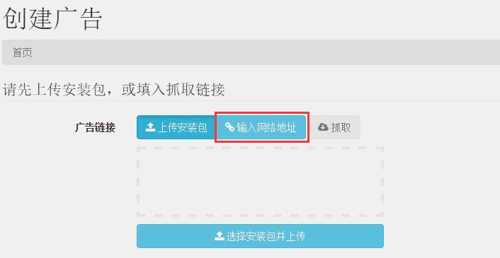

#点乐自助平台周报(2015/3/23—2015/3/27)
##改进模块
###情报里体现“下线申请”的描述

在`广告投放情报`的页面中，显示你搜索的结果中，增加了一列`下线要求`，显示下线的原因

###上传广告
####优化地方
1. 关联广告ID,生成上传日志
2. 替换包的时候更新版本和体积
3. 上传广告时上传MD5，与服务器端进行对比，判断上传是否成功
4. 更新广告的时候也可以抓包
5. 更新广告上传时，窗口不能关闭

###邮件通知

当商务进行以下操作时，会发邮件通知运营，这样可以让运营及时知道，现在可以兼容foxmail

1. 创建广告
2. 申请修改广告量级等
3. 修改广告备注
4. 修改定价
5. 更新包

###统计数据

在`统计`—>`广告统计`页面列表中增加了广告的点击数和激活数

###权限系统
####优化地方
1. 不同的用户加载不同侧边栏导航
2. 不是自己的广告不能编辑
3. 只能查看自己的广告

###其他改进
1. 广告数据反馈形式已增加'按点乐数据结算
2. 表格中筛选等操作已保留下来

##特别介绍—`抓取安装包`功能

抓取安装包的功能可以直接输入安装包的网络地址，服务器就可以自动获取安装包的所有信息，并填充在相应的位置上。

###操作步骤
* 在`广告`—>`创建广告`页面中,点击`输入网络地址`
    * 
* 填入安装包的下载地址
    * 
* 输入完网络地址后，点击抓取
    * 
* 抓取完后，服务器会弹出一个提示抓取成功的对话框，点击确认即可
    * 

##下周计划任务
1. 自动发送报备邮件
2. 邮件内容抓取
3. 丰富广告属性页的内容